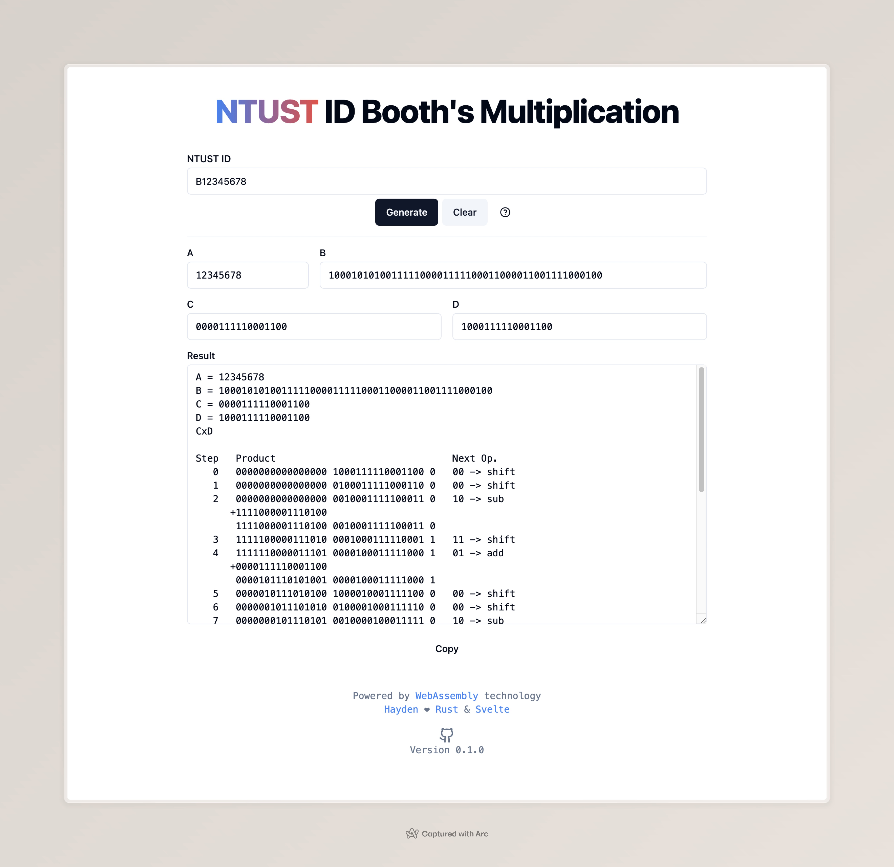

# generator-web



## Build prerequisites

- [rust](https://www.rust-lang.org/)
- [wasm-pack](https://rustwasm.github.io/wasm-pack/)
- Javascript runtime: [Node.js](https://nodejs.org/) / [Bun](https://bun.sh/)
- Package manager: [npm](https://www.npmjs.com/) / [yarn](https://yarnpkg.com/) / [pnpm](https://pnpm.io/) / [Bun](https://bun.sh/)
- [The generator library](../generator/)

## Build

Examples use Bun as JS runtime and package manager

### 1. Build rust code to wasm

```bash
bun run wasm
```

### 2. Install the dependencies

```bash
bun install
```

### 3. Build or development

```bash
bun run dev
```

of

```bash
bun run build
```
