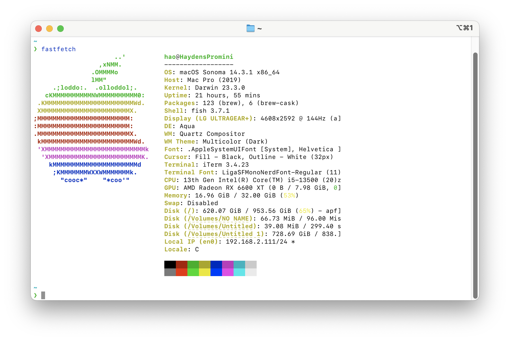

<div class="cover" style="break-after:page;font-family:方正公文仿宋;width:100%;height:100%;border:none;margin: 0 auto;text-align:center;">
    <div style="width:60%;margin: 0 auto;height:0;padding-bottom:10%;">
        </br>
        
    </div>
    </br></br></br></br></br>
    <div style="width:60%;margin: 0 auto;height:0;padding-bottom:40%;">
        
	</div>
    </br></br></br></br></br></br></br></br>
    <span style="font-family:华文黑体Bold;text-align:center;font-size:20pt;margin: 10pt auto;line-height:30pt;">《Effect of L1 Cache on Program Performance》</span>
    <p style="text-align:center;font-size:14pt;margin: 0 auto">CS2006301 Computer Organization</p>
    </br>
    </br>
    <table style="border:none;text-align:center;width:72%;font-family:仿宋;font-size:14px; margin: 0 auto;">
    <tbody style="font-family:方正公文仿宋;font-size:12pt;">
    	<tr style="font-weight:normal;"> 
    		<td style="width:20%;text-align:right;">Course</td>
    		<td style="width:2%">：</td> 
    		<td style="width:40%;font-weight:normal;border-bottom: 1px solid;text-align:center;font-family:华文仿宋">Computer Organization</td>     </tr>
    	<tr style="font-weight:normal;"> 
    		<td style="width:20%;text-align:right;">Professor</td>
    		<td style="width:2%">：</td> 
    		<td style="width:40%;font-weight:normal;border-bottom: 1px solid;text-align:center;font-family:华文仿宋">劉一宇</td>     </tr>
    	<tr style="font-weight:normal;"> 
    		<td style="width:20%;text-align:right;">Name</td>
    		<td style="width:2%">：</td> 
    		<td style="width:40%;font-weight:normal;border-bottom: 1px solid;text-align:center;font-family:华文仿宋">張皓鈞</td>     </tr>
    	<tr style="font-weight:normal;"> 
    		<td style="width:20%;text-align:right;">Student ID</td>
    		<td style="width:2%">：</td> 
    		<td style="width:40%;font-weight:normal;border-bottom: 1px solid;text-align:center;font-family:华文仿宋">B11030202</td>     </tr>
    	<tr style="font-weight:normal;"> 
    		<td style="width:20%;text-align:right;">Class</td>
    		<td style="width:%">：</td> 
    		<td style="width:40%;font-weight:normal;border-bottom: 1px solid;text-align:center;font-family:华文仿宋">資工二乙</td>     </tr>
    	<tr style="font-weight:normal;"> 
    		<td style="width:20%;text-align:right;">Date</td>
    		<td style="width:2%">：</td> 
    		<td style="width:40%;font-weight:normal;border-bottom: 1px solid;text-align:center;font-family:华文仿宋">2024/05/30</td>     </tr>
    </tbody>              
    </table>
</div>

# Effect of L1 Cache on Program Performance

<center><div style='height:2mm;'></div><div style="font-size:14pt;">張皓鈞 Hayden Chang</div></center>
<center><span style="font-size:9pt;line-height:9mm"><i>National Taiwan University of Science and Technology</i></span>
</center>
<div>
<div style="width:82px;float:left;line-height:16pt"><b>Abstract: </b></div> 
<div style="overflow:hidden;line-height:16pt">
L1 cache is critical for enhancing program performance in modern computer systems by reducing CPU data access time. This study examines the impact of various L1 cache configurations, particularly cache block sizes, on performance. Experimental results indicate that moderately increasing cache block size reduces miss rates and improves performance, while excessively large block sizes degrade performance. These insights aim to guide optimal L1 cache design for balanced performance.
</div>
</div>

<div>
<div style="width:82px;float:left;line-height:16pt"><b>Key Words: </b></div> 
<div style="overflow:hidden;line-height:16pt">Computer; Computer Organization; CPU; Cache; L1 Cache; Performence;</div>
</div>

## Introduction

​	In this project, the Gem5 simulator is used to study the performance impact of different cache configurations on a simple computational program. The cache miss rate is compared by adjusting the total cache size, the cache correlation and the cache block size.

## Methodologies

​	Design a test sample program that traverses a large array of random and sequential interviews.
Then compile it into a RISC-V platform executable for simulation in the gem5 simulator.

### Test Environment



#### macOS

```
Darwin HaydensPromini.lan 23.3.0 Darwin Kernel Version 23.3.0: Wed Dec 20 21:28:58 PST 2023; root:xnu-10002.81.5~7/RELEASE_X86_64 x86_64
```

#### gem5 (Simulation Target RISC-V)

> Compiled on my device

```
gem5 Simulator System.  https://www.gem5.org
gem5 is copyrighted software; use the --copyright option for details.

gem5 version 23.1.0.0
gem5 compiled May  8 2024 10:43:00
gem5 started May 19 2024 22:14:45
gem5 executing on HaydensPromini.lan, pid 30640
command line: ./gem5.opt
```

#### RISC-V GCC

> Install pre-compiled toolchain by [Homebrew](https://github.com/riscv-software-src/homebrew-riscv)

```
riscv64-unknown-elf-gcc (gc891d8dc2) 13.2.0
Copyright (C) 2023 Free Software Foundation, Inc.
This is free software; see the source for copying conditions.  There is NO
warranty; not even for MERCHANTABILITY or FITNESS FOR A PARTICULAR PURPOSE.
```

#### Python3

```
Python 3.11.9
```

### Test Sample

[./Test Samples](./Test Samples)

I prepare a set of test samples and in the next report I will use sample 3 for testing.

#### Sample 3

[./Test Samples/sample3](./Test Samples/sample3)

```c
#include <stdio.h>
#include <stdlib.h>
#include <time.h>

const size_t ARRAY_SIZE = 10000;

/**
 * @brief Function to perform sequential access pattern on an integer array.
 *
 * This function takes an integer array as input and performs a sequential
 * access pattern. Each element of the array is incremented once. The sequential
 * access is achieved by iterating through the array and incrementing each
 * element.
 *
 * @param arr Pointer to the integer array.
 *
 * @return void.
 */
void sequential_access(int *arr) {
  for (int i = 0; i < ARRAY_SIZE; ++i) {
    arr[i]++;
  }
}

/**
 * @brief Function to perform random access pattern on an integer array.
 *
 * This function takes an integer array as input and performs a random access
 * pattern. Each element of the array is incremented once. The random access is
 * achieved by generating a random index within the array size and incrementing
 * the corresponding element.
 *
 * @param arr Pointer to the integer array.
 *
 * @return void.
 */
void random_access(int *arr) {
  for (int i = 0; i < ARRAY_SIZE; ++i) {
    int index = rand() % ARRAY_SIZE;
    arr[index]++;
  }
}

int main() {
  // Allocate memory for the array
  // and check if the memory allocation
  int *arr = (int *)calloc(ARRAY_SIZE, sizeof(int));
  if (arr == NULL) {
    fprintf(stderr, "Memory allocation failed\n");
    return 1;
  }

  // Set the seeds of the random number
  // generator through the current time
  srand(time(NULL));

  // Random access pattern
  random_access(arr);

  // Sequential access pattern
  sequential_access(arr);

  // Release the memory
  free(arr);

  return 0;
}
```

### Benchmark

To simplify the steps and process of testing, I wrote a Python3 Script to evaluate the performance.

This script can be used to evaluate the growth rate of miss rates for cacheline sizes of 8 bytes, 16 bytes, 32 bytes, 64 bytes, 128 bytes, 256 bytes.

#### Benchmark Script

[./Scripts/benchmark.py](./Scripts/benchmark.py)

```python
import os
import subprocess

from decimal import Decimal, getcontext

import click


# Set decimal point accuracy
getcontext().prec = 6

g_gem5_executable: str = "../build/RISCV/gem5.opt"
g_gem5_config: str = "../configs/deprecated/example/se.py"
g_test_program: str = ""


def extract_miss_rate(stats_file: str) -> tuple[Decimal, Decimal]:
    def get_value_from_stats(keyword) -> str | None:
        result = subprocess.run(
            ["grep", keyword, stats_file], capture_output=True, text=True
        )
        return result.stdout.split()[1] if result.stdout else None

    dcache_misses = get_value_from_stats("system.cpu.dcache.overallMisses::total")
    icache_misses = get_value_from_stats("system.cpu.icache.overallMisses::total")
    dcache_accesses = get_value_from_stats("system.cpu.dcache.overallAccesses::total")
    icache_accesses = get_value_from_stats("system.cpu.icache.overallAccesses::total")

    if not all([dcache_misses, icache_misses, dcache_accesses, icache_accesses]):
        raise ValueError(
            f"Error: Failed to extract miss or access rates from {stats_file}."
        )

    if any(
        v is None
        for v in [dcache_misses, icache_misses, dcache_accesses, icache_accesses]
    ):
        raise ValueError(
            f"Error: Failed to extract miss or access rates from {stats_file}."
        )

    dcache_miss_rate = Decimal(dcache_misses) / Decimal(dcache_accesses)  # type: ignore
    icache_miss_rate = Decimal(icache_misses) / Decimal(icache_accesses)  # type: ignore

    return dcache_miss_rate, icache_miss_rate


def calculate_growth_rate(new_rate: Decimal, base_rate: Decimal) -> Decimal:
    return ((new_rate - base_rate) / base_rate * 100).quantize(Decimal("0.01"))


def run_simulation(
    l1i_size: str | int,
    l1i_assoc: str | int,
    l1d_size: str | int,
    l1d_assoc: str | int,
    cacheline_size: str | int,
    output_dir: str,
) -> None:
    global g_gem5_executable, g_gem5_config, g_test_program

    os.makedirs(output_dir, exist_ok=True)
    command = [
        g_gem5_executable,
        g_gem5_config,
        "--caches",
        f"--l1i_size={l1i_size}",
        f"--l1i_assoc={l1i_assoc}",
        f"--l1d_size={l1d_size}",
        f"--l1d_assoc={l1d_assoc}",
        f"--cacheline_size={cacheline_size}",
        "-c",
        g_test_program,
    ]
    with open(f"{output_dir}/gem5.log", "w") as log_file:
        subprocess.run(command, stdout=log_file, stderr=subprocess.STDOUT)
    subprocess.run(["cp", "m5out/stats.txt", f"{output_dir}/stats.txt"])
    subprocess.run(["cp", "m5out/config.ini", f"{output_dir}/config.ini"])


@click.command()
@click.option(
    "-g",
    "--gem5_executable",
    help="gem5 executable path",
    required=True,
    type=str,
)
@click.option(
    "-c",
    "--gem5_config",
    help="gem5 config script",
    required=True,
    type=str,
)
@click.option(
    "-p",
    "--test_program",
    help="test program executable",
    required=True,
    type=str,
)
def main(gem5_executable: str, gem5_config: str, test_program: str) -> None:
    global g_gem5_executable, g_gem5_config, g_test_program
    g_gem5_executable = gem5_executable
    g_gem5_config = gem5_config
    g_test_program = test_program

    base_config = ("8kB", 2, "8kB", 2, 64, "m5out/base")
    run_simulation(*base_config)

    cacheline_sizes = [8, 16, 32, 128, 256]
    for cacheline_size in cacheline_sizes:
        run_simulation(
            "8kB", 2, "8kB", 2, cacheline_size, f"m5out/cacheline_size={cacheline_size}"
        )

    base_dcache_miss_rate, base_icache_miss_rate = extract_miss_rate(
        "m5out/base/stats.txt"
    )

    for cacheline_size in cacheline_sizes:
        dcache_miss_rate, icache_miss_rate = extract_miss_rate(
            f"m5out/cacheline_size={cacheline_size}/stats.txt"
        )
        dcache_miss_growth = calculate_growth_rate(
            dcache_miss_rate, base_dcache_miss_rate
        )
        icache_miss_growth = calculate_growth_rate(
            icache_miss_rate, base_icache_miss_rate
        )

        print("=" * 50)
        print(f"Cacheline Size = {cacheline_size} bytes")
        print(f"Data Cache Miss Rate Growth = {dcache_miss_growth}%")
        print(f"Instruction Cache Miss Rate Growth = {icache_miss_growth}%")
        print("=" * 50)


if __name__ == "__main__":
    main()
```

### Full Test Steps

Next, I will show the complete process of evaluating the performance impact of L1 Cache.

#### 1. Build Test Program

```shell
$ riscv64-unknown-elf-gcc ./Test\ Samples/sample3/main.c -O1 -static -o ./Test\ Samples/sample3/build/main
```

#### 2. Run Benchmark Script

First install all dependencies

```shell
$ pip3.11 install -r ./Scripts/requirements.txt
```

Then run the benchmark script

```shell
$ python3.11 ./Scripts/benchmark.py -g /Users/hao/Playground/gem5/build/RISCV/gem5.opt -c /Users/hao/Playground/gem5/configs/deprecated/example/se.py -p /Users/hao/GitHub/CS2006301-Computer-Organization/Projects/Project04/Test\ Samples/sample3/build/main
```

## Results Analysis

```
$ python3.11 ./Scripts/benchmark.py -g /Users/hao/Playground/gem5/build/RISCV/gem5.opt -c /Users/hao/Playground/gem5/configs/deprecated/example/se.py -p /Users/hao/GitHub/CS2006301-Computer-Organization/Projects/Project04/Test\ Samples/sample3/build/main

==================================================
Cacheline Size = 8 bytes
Data Cache Miss Rate Growth = 94.75%
Instruction Cache Miss Rate Growth = 338.89%
==================================================
==================================================
Cacheline Size = 16 bytes
Data Cache Miss Rate Growth = 41.21%
Instruction Cache Miss Rate Growth = 153.70%
==================================================
==================================================
Cacheline Size = 32 bytes
Data Cache Miss Rate Growth = 13.71%
Instruction Cache Miss Rate Growth = 55.56%
==================================================
==================================================
Cacheline Size = 128 bytes
Data Cache Miss Rate Growth = -6.60%
Instruction Cache Miss Rate Growth = -33.33%
==================================================
==================================================
Cacheline Size = 256 bytes
Data Cache Miss Rate Growth = -9.94%
Instruction Cache Miss Rate Growth = -57.41%
==================================================
```

Organize the results into a table.

| Cacheline Size | Data Cache Miss Rate Growth | Instruction Cache Miss Rate Growth |
| -------------- | --------------------------- | ---------------------------------- |
| 8 bytes        | 94.75%                      | 338.89%                            |
| 16 bytes       | 41.21%                      | 153.70%                            |
| 32 bytes       | 13.71%                      | 55.56%                             |
| 128 bytes      | -6.60%                      | -33.33%                            |
| 256 bytes      | -9.94%                      | -57.41%                            |

```mermaid
gantt
    title Miss Rate Growth
    dateFormat  X
    axisFormat %s

    section 8 bytes
    Data Cache Miss Rate Growth   : 0, 95
    Instruction Cache Miss Rate Growth   : 0, 339
    section 16 bytes
    Data Cache Miss Rate Growth   : 0, 41
    Instruction Cache Miss Rate Growth   : 0, 154
    section 32 bytes
    Data Cache Miss Rate Growth   : 0, 14
    Instruction Cache Miss Rate Growth   : 0, 56
    section 128 bytes
    Data Cache Miss Rate Growth   : -7, 0
    Instruction Cache Miss Rate Growth   : -33, 0
    section 256 bytes
    Data Cache Miss Rate Growth   : -10, 0
    Instruction Cache Miss Rate Growth   : -57, 0
```



## Conclusion

The results show that the cache block size is a key factor affecting the cache miss rate. Specifically, this study found:

1. **Relationship between cache block size and cache miss rate**: The latest experimental data indicate that as the cache block size increases, the growth rate of the cache miss rate shows different trends. Particularly, when the cache block size is 8 and 16 bytes, the data cache miss rate and instruction cache miss rate increased by 94.75% and 338.89%, and 41.21% and 153.70%, respectively. These results suggest that a smaller cache block size may lead to a higher cache miss rate.
2. **The improvement effect of moderately increasing cache block size**: From the experimental data for cache block sizes from 8 to 32 bytes, the percentage growth of the cache miss rate gradually decreases as the cache block size increases. This finding indicates that moderately increasing the cache block size can effectively reduce the cache miss rate, thereby improving system performance.
3. **Negative impact of cache block size exceeding the optimal range**: When the cache block size increased to 128 and 256 bytes, the percentage growth of the data cache miss rate and instruction cache miss rate showed negative values, at -6.60% and -33.33%, and -9.94% and -57.41%, respectively. This suggests that further increasing the block size beyond a certain range may lead to performance degradation, possibly because the size of the cache line exceeds the optimal match between hardware and software.

To further quantify these observations, we propose the following mathematical model to describe the relationship between the cache miss rate ( M ) and the cache block size ( B ):
$$
M(B) = k \cdot (\frac{1}{B} - \frac{1}{B^2}) + c
$$
Where ( k ) and ( c ) are constants adjusted based on experimental data. The model predicts that as the cache block size increases, the miss rate ( M ) will first increase to a peak value and then decrease as the cache block size further increases. This peak value represents the optimal cache block size.

In summary, appropriately adjusting the cache block size can improve the cache performance of the system to a certain extent. However, selecting the optimal cache block size requires evaluation based on specific application scenarios to achieve the best balance between cache size and system performance.
