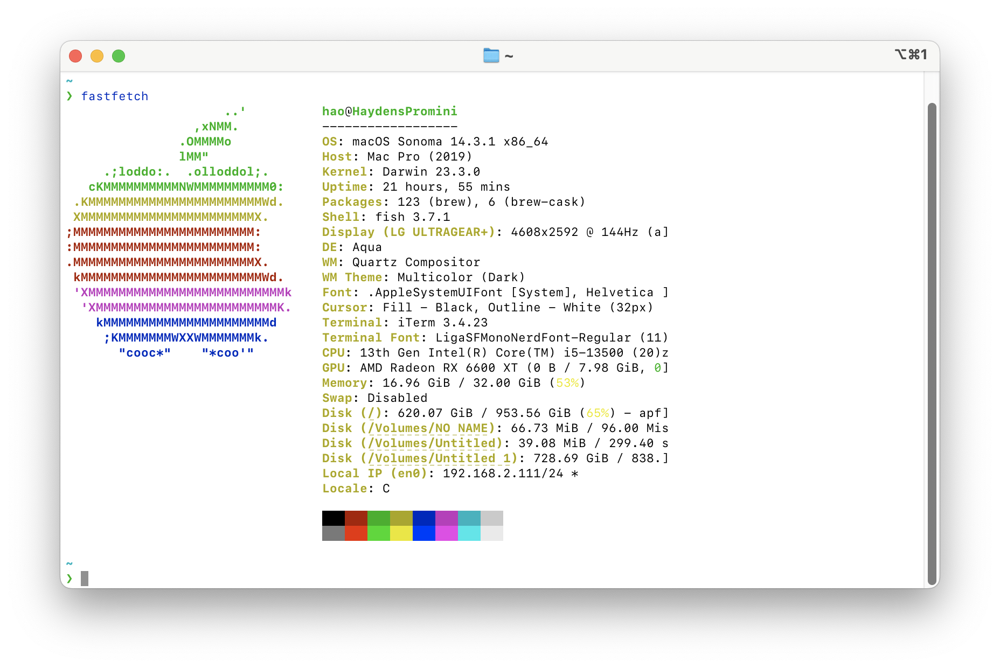

# CS2006301-Simulator with L1 Cache

> 資訊工程系 二年級 乙班 張皓鈞 B11030202

## Introduction

​	In this project, the Gem5 simulator is used to study the performance impact of different cache configurations on a simple computational program. The cache miss rate is compared by adjusting the total cache size, the cache correlation and the cache block size.

## Methodologies

​	Design a test sample program that traverses a large array of random and sequential interviews.
Then compile it into a RISC-V platform executable for simulation in the gem5 simulator.

### Test Environment



#### macOS

```
Darwin HaydensPromini.lan 23.3.0 Darwin Kernel Version 23.3.0: Wed Dec 20 21:28:58 PST 2023; root:xnu-10002.81.5~7/RELEASE_X86_64 x86_64
```

#### gem5 (Simulation Target RISC-V)

> Compiled on my device

```
gem5 Simulator System.  https://www.gem5.org
gem5 is copyrighted software; use the --copyright option for details.

gem5 version 23.1.0.0
gem5 compiled May  8 2024 10:43:00
gem5 started May 19 2024 22:14:45
gem5 executing on HaydensPromini.lan, pid 30640
command line: ./gem5.opt
```

#### RISC-V GCC

> Install pre-compiled toolchain by [Homebrew](https://github.com/riscv-software-src/homebrew-riscv)

```
riscv64-unknown-elf-gcc (gc891d8dc2) 13.2.0
Copyright (C) 2023 Free Software Foundation, Inc.
This is free software; see the source for copying conditions.  There is NO
warranty; not even for MERCHANTABILITY or FITNESS FOR A PARTICULAR PURPOSE.
```

### Test Sample

```c
```

